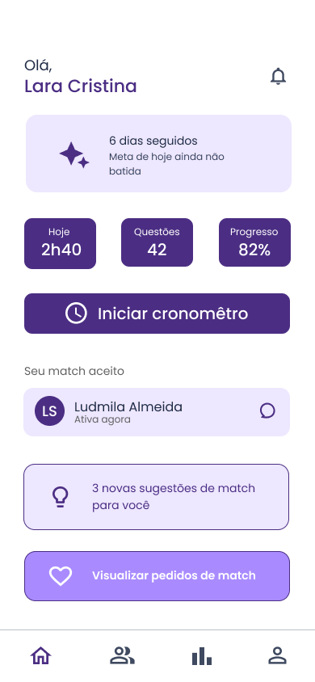
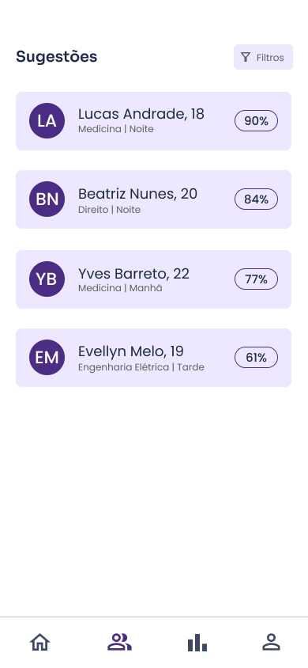
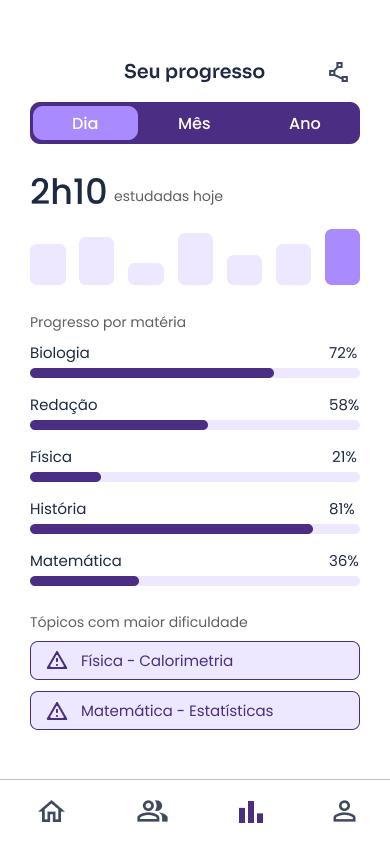
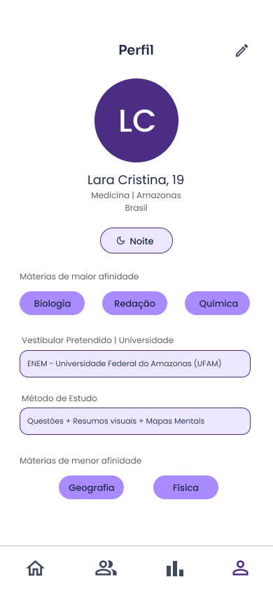
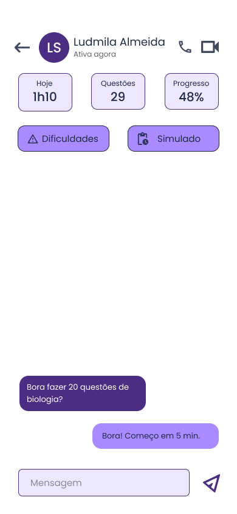
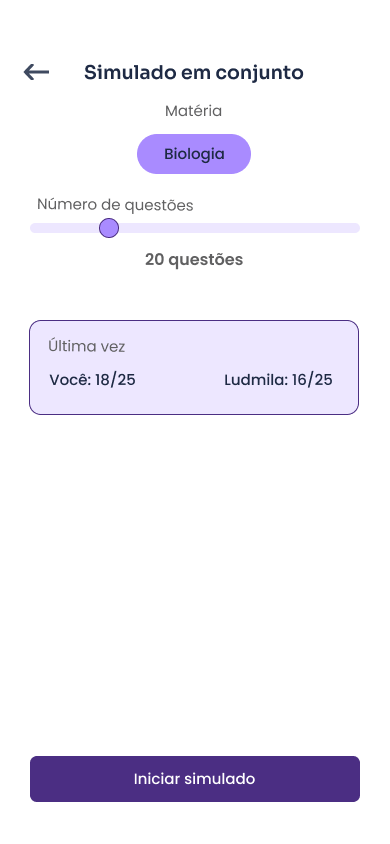

# Design do Projeto MindMate

## Sobre o projeto

O **MindMate** é um aplicativo voltado para quem estuda para concurso ou vestibular, com uma funcionalidade de **match** que conecta parceiros de estudo para reduzir a solidão e aumentar a motivação durante os estudos.

---

## Identidade Visual

### Paleta de cores

A paleta foi escolhida em tons **frios e próximos do monocromático**, pensada para transmitir **calma e tranquilidade** durante o estudo, mesmo com a motivação vindo do parceiro de match.

**Azul-marinho (#1E2A44)**: transmite seriedade, foco e estabilidade.

**Roxo profundo (#4B2E83)**: remete à criatividade e à conexão entre os parceiros de estudo.

**Lilás (#A98BFF)**: usado para destacar botões e elementos interativos.

**Cinza (#606061)**: mantém a interface neutra e equilibrada.

**Lilás claro (#EDE7FF) e branco (#FFFFFF)**: garantem leveza e boa leitura no fundo da interface.

### Logo

A logo é formada por um **laço do infinito em duas cores**, representando **duas pessoas se conectando** através do estudo em dupla.

---

## Telas do aplicativo

### Home

  

### Sugestões

  

### Progresso

  

### Perfil

  

### Chat

  

### Simulado em conjunto

  

---

## Protótipo no Figma

O design e o protótipo das telas do aplicativo foram desenvolvidos no **Figma**.

🔗 [Acessar o projeto no Figma](https://www.figma.com/design/e2G2ydQHuntYoNVat46Omm/MindMate?node-id=131-507&t=CoiZrsAxeNKdaBvX-1)

---

## Ferramenta utilizada

- **Figma** — criação da identidade visual, prototipação e desenvolvimento das interfaces do aplicativo.
